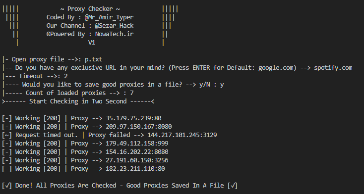

# Proxy-Checker
Proxy Checker via File (.txt)

 

 

# How to instal on Linux and Windows:
<pre><code>
apt install python3
apt install pip
pip install -r requirements.txt
</code></pre>

# How to instal on Termux:
<pre><code>
pkg install python3
pkg install pip
pip install -r requirements.txt
</code></pre>

# Download And Run
<pre><code>
git clone https://github.com/Amirtyper/Proxy-Checker/
cd Proxy-Checker
python3 Checker.py
</code></pre>

# Coded by: Mr_Amir_Typer
<pre><code>
Developer Telegram: <a href="https://t.me/Mr_Amir_Typer">Mr_Amir_Typer</a>
Developer Instagram: <a href="https://instagram.com/amir_typer">amir_typer</a>
Developer Twitter: <a href="https://twitter.com/AmirTyper">AmirTyper</a>
Our Website: <a href="https://Nowatech.ir">Nowatech.ir</a>
Our Channel: <a href="https://t.me/Sezar_Hack">Sezar_Hack</a>
</code></pre>
